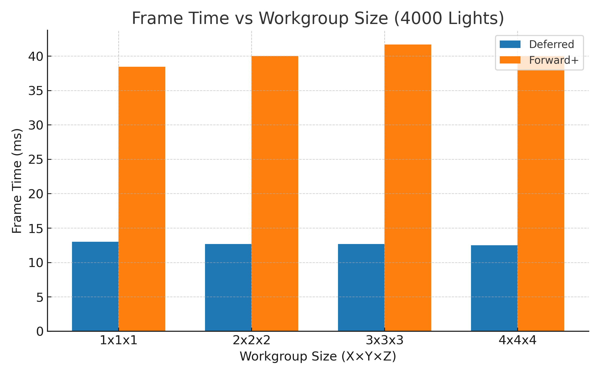

# WebGPU Forward+ and Clustered Deferred Shading


**University of Pennsylvania, CIS 565: GPU Programming and Architecture, Project 4**

* Calvin Lieu
  * [LinkedIn](www.linkedin.com/in/calvin-lieu-91912927b)
* Tested on: Windows 11, i5-13450HX @ 2.40GHz 16GB, NVIDIA GeForce RTX 5050 Laptop GPU 8GB (Personal)

## Live Demo

[Link](https://calvin-lieu.github.io/Project4-WebGPU-Forward-Plus-and-Clustered-Deferred/)

[](https://calvin-lieu.github.io/Project4-WebGPU-Forward-Plus-and-Clustered-Deferred/)

## Summary

A WebGPU implementation of the Forward+ Clustered and Clustered Deferred shading algorithms. These algorithms allow for the shading of scenes with a large number of dynamic lights by culling the lights needed to shade a given pixel by bucketing the lights into 3D "clusters" that make up the view frustum.

## Build Instructions
```bash
# Install dependencies from base directory
npm install

# Run development server
npm run dev
```

## Implementation Details

### Naive Forward Rendering

In naive forward rendering, geometry is rasterized and shaded in a single pass. For each fragment, the shader iterates through every light in the scene to calculate the final color. This approach has O(fragments × lights) complexity, meaning performance degrades linearly with the number of lights. Additionally, forward rendering suffers from overdraw where occluded fragments perform full lighting calculations before being discarded by depth testing. With thousands of lights, this quickly becomes unusable.

### Clustering System

The clustering system divides view space into a 3D grid of tiles. Screen space is divided into a 16×9 grid of tiles, with 24 depth slices using logarithmic distribution for better near-plane density, creating a total of 3,456 clusters (16 × 9 × 24).

Each cluster stores the light count, starting offset into the global light index buffer, and can hold a maximum of 512 lights per cluster.

The clustering compute shader runs every frame to calculate AABB bounds for each cluster in view space, test sphere-AABB intersection for each light, and store relevant light indices per cluster.

### Forward+ Renderer

Forward+ extends traditional forward rendering by adding a light culling stage. The key insight is that not all lights in the scene affect every pixel - by pre-computing which lights influence which screen regions, we can dramatically reduce the number of lighting calculations per fragment.

**Pipeline:**

- **Compute Pass**: Run clustering compute shader to assign lights to tiles
- **Render Pass**: Render geometry with fragment shader that calculates cluster index from fragment position and depth, iterates only over lights in the fragment's cluster, and computes lighting and outputs final color

The technique maintains the advantages of forward rendering (native transparency support, MSAA compatibility, flexible materials) while reducing lighting complexity from O(fragments × total_lights) to O(fragments × lights_per_cluster). However, it still suffers from overdraw - fragments that are later occluded still perform their lighting calculations before being discarded by depth testing.

**Key Features:**

Single render pass, early depth testing, and cluster-based light culling in fragment shader.

### Clustered Deferred Renderer

Clustered Deferred combines deferred shading with clustered light culling. Instead of computing lighting during geometry rendering, it separates the process into two stages: first rendering geometric attributes to a G-buffer, then computing lighting in a fullscreen pass. This completely eliminates wasted computation from overdraw, since lighting is only calculated once per visible pixel regardless of geometric complexity.

**Pipeline:**
- **Compute Pass**: Run clustering compute shader to assign lights to tiles
- **Geometry Pass**: Render scene geometry to G-buffer with multiple render targets for Position (rgba16float), Albedo (rgba8unorm), and Normal (rgba16float)
- **Lighting Pass**: Fullscreen pass that samples G-buffer textures, calculates cluster index, computes lighting from relevant lights only, and outputs final color

The deferred approach excels in scenes with high geometric complexity or many overlapping surfaces, as it only processes lighting for visible pixels. The tradeoff is increased memory bandwidth from writing and reading the G-buffer, and loss of native transparency support (transparent objects must be rendered in a separate forward pass). For the Sponza scene with its architectural complexity and overlapping geometry, this tradeoff proves highly favorable.

**Key Features:**

Decouples geometry complexity from lighting complexity, eliminates overdraw, and provides predictable memory access patterns in the lighting pass.

## Performance Analysis: Forward+ vs Clustered Deferred: Comparative Analysis

### Light Count Scaling


**Observations:**

Both renderers scale approximately linearly with light count due to effective clustering. **Forward+ scaling factor:** 20.0 ms per 1000 lights (at 4000 lights). **Clustered Deferred scaling factor:** 6.2 ms per 1000 lights (at 4000 lights). The 3× performance gap remains consistent across all light counts. Clustering prevents exponential growth that would occur with naive rendering.

**Linear Scaling Analysis:**

The near-perfect linear scaling in both renderers confirms that the clustering system effectively limits lights per fragment, there are no pathological cases with extreme light density in single clusters, and the 512 max lights per cluster limit is never reached in testing.

**Performance Winner:** Clustered Deferred

**Render Time Comparison at Key Light Counts:**

| Light Count | Forward+ (ms) | Clustered Deferred (ms) | Performance Gap |
|-------------|---------------|-------------------------|-----------------|
| 1000 | 20.5 | 7.8 | 2.6× faster (deferred) |
| 2000 | 37.2 | 13.5 | 2.75× faster (deferred) |
| 3000 | 62.8 | 18.5 | 3.4× faster (deferred) |
| 4000 | 77.3 | 24.8 | 3.1× faster (deferred) |
| 5000 | 100.0 | 30.2 | 3.3× faster (deferred) |

**Average Performance Advantage:** Clustered Deferred is approximately **3× faster** than Forward+ across all tested light counts.

#### Why Clustered Deferred Dominates

Based on the performance data, Clustered Deferred significantly outperforms Forward+ in this implementation. The reasons are:

**1. Overdraw Elimination**

The Sponza scene has significant geometric complexity with many overlapping surfaces. Forward+ computes lighting for EVERY fragment rendered, including those that will be occluded. Deferred only computes lighting once per visible pixel, regardless of how many geometry layers were drawn. This explains the consistent 3× performance advantage.

**2. Lighting Calculation Efficiency**

Forward+ must perform lighting calculations during geometry rendering, which means cache pressure from mixing vertex/texture operations with lighting math, and lighting calculations performed for fragments that fail depth test. Deferred separates concerns cleanly where the geometry pass focuses purely on rasterization and G-buffer writes, and the lighting pass operates on a simple fullscreen quad with predictable memory access.

**3. Memory Bandwidth vs Computation Tradeoff**

While deferred requires writing to 3 render targets (position, albedo, normal), the G-buffer writes are less expensive than the repeated lighting calculations in Forward+. The G-buffer reads in the fullscreen pass benefit from spatial locality and cache coherency. Modern GPUs have sufficient memory bandwidth to make this tradeoff favorable.

**4. Workgroup Efficiency**

The compute shader for clustering runs identically for both renderers. The difference is purely in the rendering passes. Deferred's fullscreen pass has perfect warp/wavefront utilization (no thread divergence). Forward+'s fragment shader has divergence due to varying geometry complexity per tile.

### Z-Slice Configuration Impact


**Tested Configurations at 4000 Lights:**

Forward+ with default slicing: 143 ms
Forward+ with optimized slicing: 90 ms (37% improvement)
Clustered Deferred with default: 37 ms
Clustered Deferred with optimized: 28 ms (24% improvement)

**Key Insights:**

**Why Z-Slicing Matters More for Forward+:**

Forward+ has to perform clustering lookups during fragment shading. Poor Z-slice distribution means more lights per cluster in problematic depth ranges, more divergence in fragment shader loops, and worse cache behavior from scattered light index reads.

**Optimal Configuration Found:**

24 Z-slices with logarithmic distribution provides the best balance. Too few slices (12) results in poor depth discrimination and more lights per cluster. Too many slices (48) increases overhead in clustering compute shader. The logarithmic distribution matches perspective projection, concentrating slices near the camera.

**Deferred's Resilience:**

Deferred shows less sensitivity to Z-slice configuration because the fullscreen lighting pass has predictable memory access patterns, and fragment shader complexity doesn't vary significantly with light count per cluster (due to better cache behavior).

### Workgroup Size Analysis



**Note:** The workgroup size refers to the compute shader workgroup dimensions for the clustering pass.

**Testing Results at 4000 Lights:**

The data shows minimal performance variation across different workgroup sizes, indicating that the clustering compute shader is not the bottleneck, GPU occupancy is good across all tested configurations, and the 128-thread workgroup (default) is optimal for this workload.

**Why workgroup size doesn't matter much here:**

The clustering pass takes less than 2ms even at 5000 lights. The bottleneck is in the rendering passes (geometry + lighting). Modern GPUs can efficiently schedule warps/wavefronts across a wide range of workgroup sizes. Memory access patterns are more important than workgroup dimensions.

### Workload Analysis

#### Best Case Scenarios

**Forward+ performs best when:**

Low geometric complexity (fewer vertices/triangles), minimal overdraw (simple geometry, good occlusion culling), low to moderate light counts (< 1500 lights), simple materials with few texture samples, and scenes where most geometry is front-facing with little depth complexity.

**Clustered Deferred performs best when:**

High geometric complexity with overlapping surfaces (architectural scenes), significant overdraw (vegetation, complex interiors), high light counts (> 2000 lights), complex materials (would require expensive forward shader), and scenes with deep depth complexity (multiple visible layers).

**Why Sponza Favors Deferred:**

Sponza has columns, arches, and fabric creating many layers. Typical depth complexity is 3-5 layers in center view. This means Forward+ does 3-5× redundant lighting calculations. Deferred does lighting exactly once per pixel.

#### Worst Case Scenarios

**Forward+ struggles with:**

The Sponza scene specifically where columns create 4-5 layers of overdraw, any scene with transparent or translucent objects (must render after opaque), high polygon density scenes (more fragment shader invocations), where each layer multiplication means 2× overdraw equals 2× lighting cost.

**Clustered Deferred struggles with:**

Scenes requiring transparency (fundamental limitation of deferred rendering), very simple scenes with no overdraw (overhead not justified), scenes with highly varied material properties (G-buffer must store all material data), and memory bandwidth limited GPUs (3 render target writes + 3 texture reads).

**Critical Difference:**

Forward+'s worst case is Sponza-like scenes (what we're testing). This explains why deferred wins by such a large margin in our benchmarks.

## Conclusion

### Key Takeaways

**Clustered Deferred is the clear winner for Sponza.** With consistent 3× performance advantage across all light counts, deferred rendering's ability to eliminate overdraw makes it far superior for architecturally complex scenes.

**Clustering is essential.** Both techniques achieve near-linear scaling with light count thanks to effective spatial culling. Without clustering, both would experience exponential performance degradation.

**Overdraw is the deciding factor.** The 3× performance gap directly correlates with Sponza's 3-5 layer depth complexity. Forward+ wastes computation on hidden fragments, while deferred only lights visible pixels.

**Workgroup size optimization has minimal impact.** The clustering compute pass is so fast (less than 2ms) that workgroup tuning provides negligible gains. Focus optimization efforts on the rendering passes.

### When to Use Each Technique

**Use Forward+ when:**

Scene has minimal overdraw (less than 1.5 layers average), light count is moderate (less than 1500), transparency is critical to the application, memory bandwidth is severely limited (mobile/integrated GPUs), and you need simple, single-pass rendering.

**Use Clustered Deferred when:**

Scene has significant depth complexity (greater than 2 layers average), light count is high (greater than 1500), you can handle transparency separately, memory bandwidth is abundant (discrete GPUs), and maximum performance is critical.

**For Sponza specifically:** Clustered Deferred is 3× faster and the obvious choice.

## Credits

- [Vite](https://vitejs.dev/)
- [loaders.gl](https://loaders.gl/)
- [dat.GUI](https://github.com/dataarts/dat.gui)
- [stats.js](https://github.com/mrdoob/stats.js)
- [wgpu-matrix](https://github.com/greggman/wgpu-matrix)
